

  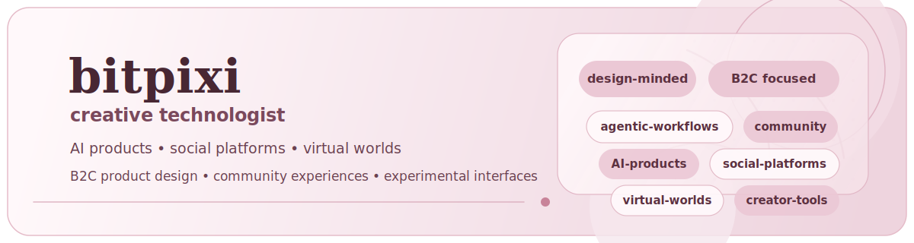

## Kasey Robinson aka "bitpixi"

Senior UX Designer & Prompt Engineer (RISD/Tufts) with 10+ years across UX Design and weird/emerging internet things -> scaled Gfycat from 80M -> 180M+ MAU later acquired by Snap (+3 AR patents), shipped top-revenue features at Meitu (450M+ MAU), and worked on early metaverse platforms, most notably Voxels, contributing to their highest sales month; now based near Melbourne, Australia. This GitHub is basically my builder brain in public -> a scratchpad of experiments, agentic ideas, half-finished adventures, and things I needed to get out of my head, so not representative of how I ship in teams or production; think sketchbook, not case study. Also, [github.com/bitpixi](https://github.com/bitpixi) is me too, but I lost access (password + domain), so this is the active account.

<table align="center" width="92%">
  <tr>
    <td><code>~ portfolio</code></td>
    <td><a href="https://bitpixi.com">bitpixi.com</a></td>
    <td><code>~ linkedin</code></td>
    <td><a href="https://linkedin.com/in/bitpixi">linkedin.com/in/bitpixi</a></td>
    <td><code>~ x</code></td>
    <td><a href="https://x.com/bitpixi">x.com/bitpixi</a></td>
  </tr>
</table>

  <picture>
    <source media="(max-width: 600px)" srcset="./assets/stickers/sticker-row.svg" width="100%">
    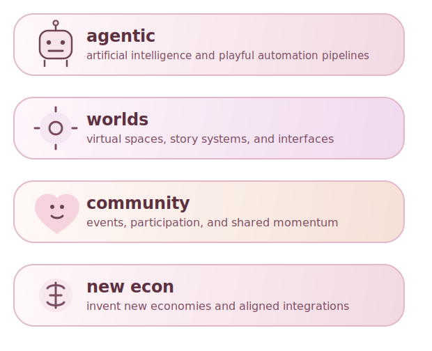
  </picture>

  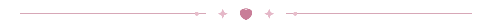

## Selected Work

<table align="center" width="92%">
  <tr>
    <td width="50%" valign="top">
      <a href="https://github.com/bitpixi2/Dyscalculia-Calculator">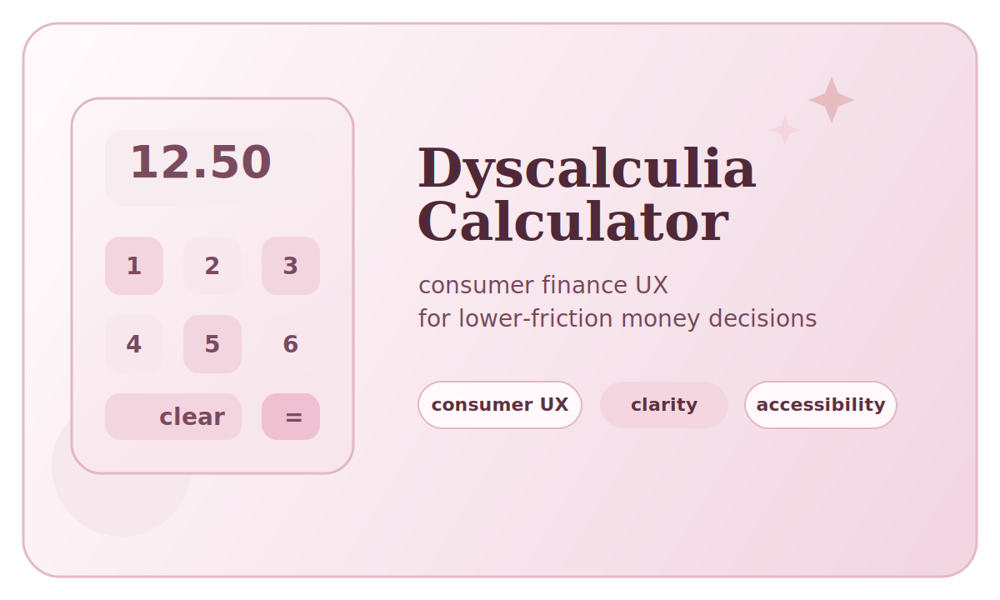</a> 
      <strong><a href="https://github.com/bitpixi2/Dyscalculia-Calculator">Dyscalculia Calculator</a></strong> 
      Consumer finance tooling designed to make money decisions easier to parse for people with dyscalculia. 
      JavaScript · consumer finance UX · accessibility
    </td>
    <td width="50%" valign="top">
      <a href="https://github.com/bitpixi2/openlabel-sk20-linux-hack">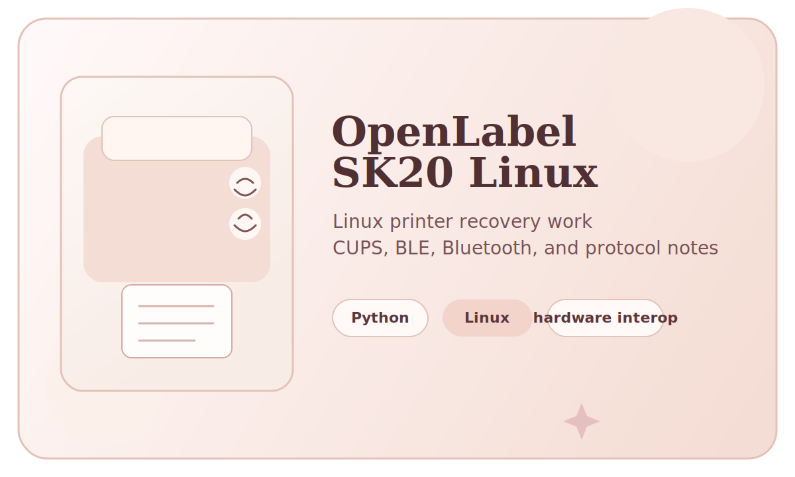</a> 
      <strong><a href="https://github.com/bitpixi2/openlabel-sk20-linux-hack">openlabel-sk20-linux-hack</a></strong> 
      Linux compatibility work that turns an app-locked thermal printer into a usable CUPS and Bluetooth path. 
      Python · Linux interop · systems debugging
    </td>
  </tr>
  <tr>
    <td width="50%" valign="top">
      <a href="https://github.com/bitpixi2/decision-balance-sheet">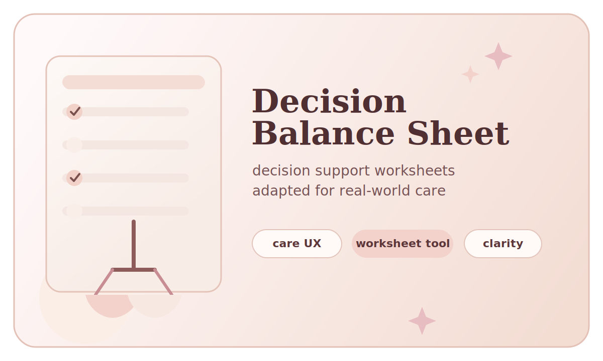</a> 
      <strong><a href="https://github.com/bitpixi2/decision-balance-sheet">decision-balance-sheet</a></strong> 
      Decision-support worksheet tooling adapted for real-world care, with an emphasis on clarity under stress. 
      Python · care tooling · decision support
    </td>
    <td width="50%" valign="top">
      <a href="https://github.com/bitpixi2/deviantclaw">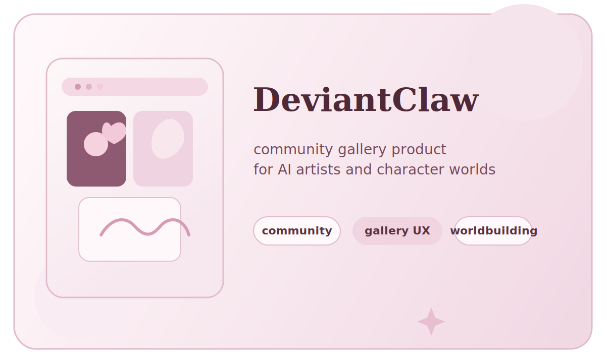</a> 
      <strong><a href="https://github.com/bitpixi2/deviantclaw">deviantclaw</a></strong> 
      A community gallery product for AI artists, character identities, and internet-native worlds. 
      JavaScript · community product · worldbuilding
    </td>
  </tr>
  <tr>
    <td width="50%" valign="top">
      <a href="https://github.com/bitpixi2/phosphor">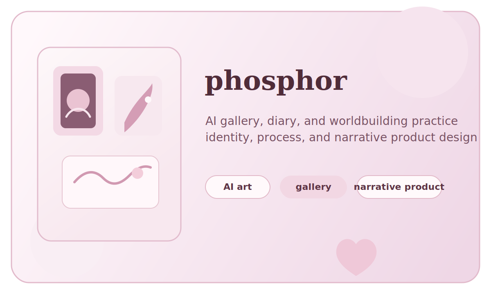</a> 
      <strong><a href="https://github.com/bitpixi2/phosphor">phosphor</a></strong> 
      An AI gallery and diary exploring identity, authorship, and worldbuilding through product form. 
      HTML · creative product · storytelling
    </td>
    <td width="50%" valign="top">
      <a href="https://github.com/bitpixi2/get-a-job">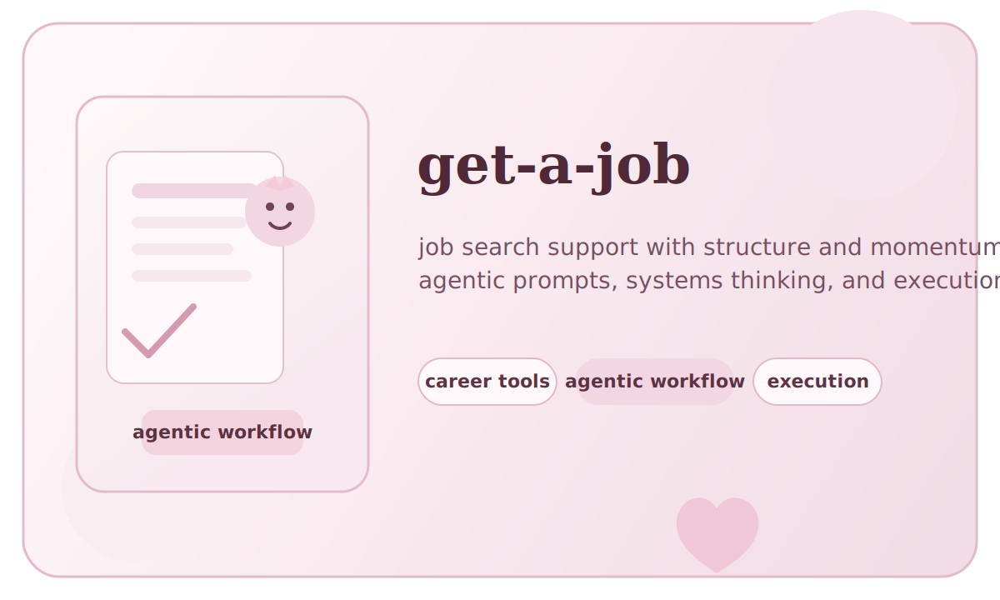</a> 
      <strong><a href="https://github.com/bitpixi2/get-a-job">get-a-job</a></strong> 
      Agentic job-search tooling for structuring leads, materials, and follow-through. 
      career tooling · agentic workflow · execution
    </td>
  </tr>
  <tr>
    <td width="50%" valign="top">
      <a href="https://github.com/bitpixi2/Bizniz-Quest-Ask">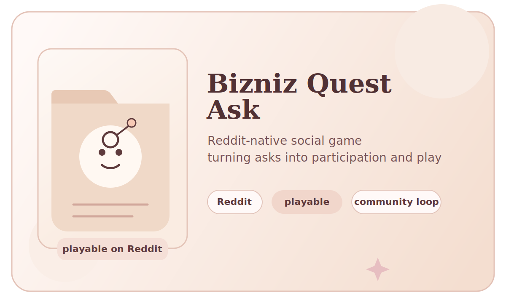</a> 
      <strong><a href="https://github.com/bitpixi2/Bizniz-Quest-Ask">Bizniz-Quest-Ask</a></strong> 
      A Reddit-native social game that turns networking asks into a loop people can actually play. 
      social game design · Reddit · community mechanics
    </td>
    <td width="50%" valign="top">
      <a href="https://github.com/bitpixi2/impress-your-valentine">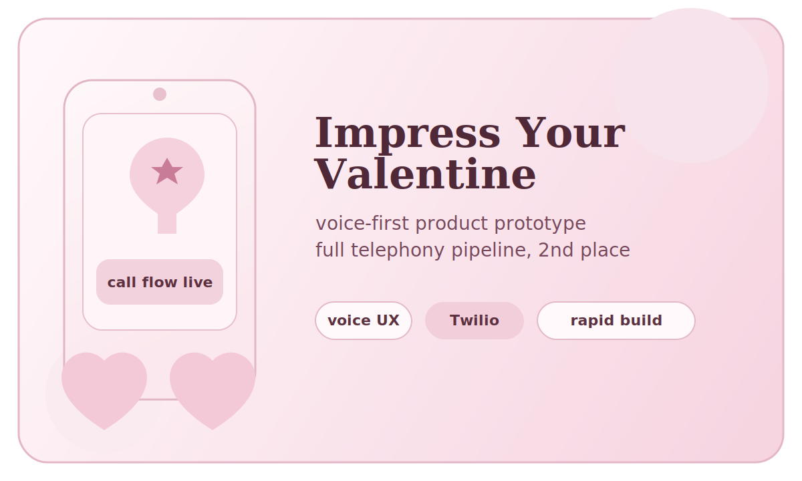</a> 
      <strong><a href="https://github.com/bitpixi2/impress-your-valentine">impress-your-valentine</a></strong> 
      A voice-first hackathon product with a full telephony pipeline and a second-place finish. 
      TypeScript · telephony · rapid delivery
    </td>
  </tr>
</table>

  

## How I Work

<table align="center">
  <tr>
    <td align="center" width="25%">
       
      <strong>shape</strong>
    </td>
    <td align="center" width="25%">
       
      <strong>bridge</strong>
    </td>
    <td align="center" width="25%">
       
      <strong>maps</strong>
    </td>
    <td align="center" width="25%">
      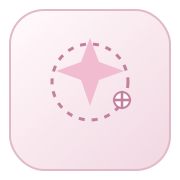 
      <strong>spark</strong>
    </td>
  </tr>
</table>

<table align="center" width="92%">
  <tr>
    <td><code>~ shape</code></td>
    <td>researching who, what, when, where and hows of the problem</td>
  </tr>
  <tr>
    <td><code>~ bridge</code></td>
    <td>strongest where design, engineering, and experimentation overlap</td>
  </tr>
  <tr>
    <td><code>~ maps</code></td>
    <td>document and diagram aggressively to untangle entropy</td>
  </tr>
  <tr>
    <td><code>~ spark</code></td>
    <td>interested in tools that reduce friction and increase agency</td>
  </tr>
</table>

  

  

